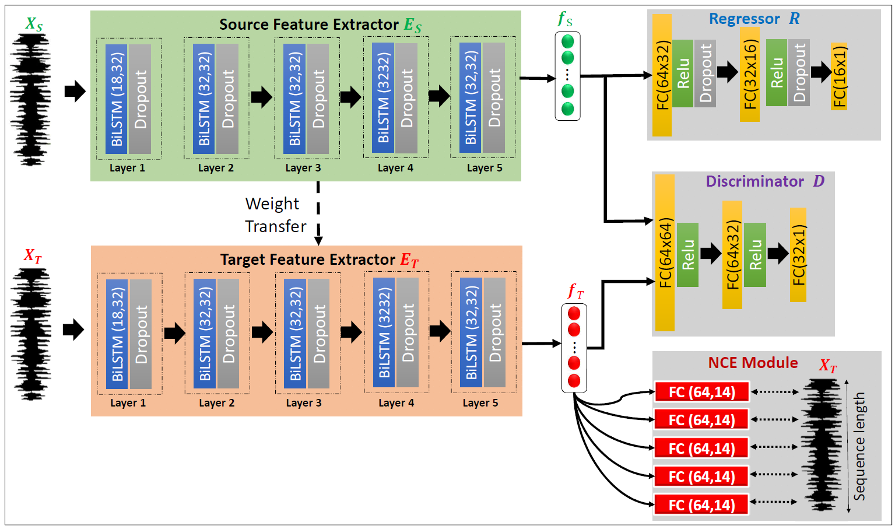

# Contrastive Adversarial Domain Adaptation for Machine Remaining Useful Life Predictionn (CADA) [[Paper](https://ieeexplore.ieee.org/document/9234721)]
#### *by: Mohamed Ragab, Zhenghua Chen, Min Wu, Haoliang Li, Chee Keong Kwoh, Ruqiang Yan, and  Xiaoli Li*
#### IEEE Transactions on Industrial Informatics (TII-21) (Impact Factor: 10.215).

## Abstract

Enabling precise forecasting of the remaining useful life (RUL) for machines can reduce maintenance cost, increase availability, and prevent catastrophic consequences. Data-driven RUL prediction methods have already achieved acclaimed performance. However, they usually assume that the training and testing data are collected from the same condition (same distribution or domain), which is generally not valid in real industry. Conventional approaches to address domain shift problems attempt to derive domain-invariant features, but fail to consider target-specific information, leading to limited performance. To tackle this issue, in this article, we propose a contrastive adversarial domain adaptation (CADA) method for cross-domain RUL prediction. The proposed CADA approach is built upon an adversarial domain adaptation architecture with a contrastive loss, such that it is able to take target-specific information into consideration when learning domain-invariant features. To validate the superiority of the proposed approach, comprehensive experiments have been conducted to predict the RULs of aeroengines across 12 cross-domain scenarios. The experimental results show that the proposed method significantly outperforms state-of-the-arts with over 21% and 38% improvements in terms of two different evaluation metrics.

## Requirmenets:
- Python3.x
- Pytorch==1.7
- Numpy
- Sklearn
- Pandas
- mat4py (for Fault diagnosis preprocessing)

## Datasets
### Download Datasets
We used NASA turbofan engines dataset
- [CMAPPS](https://catalog.data.gov/dataset/c-mapss-aircraft-engine-simulator-data)

### Prepare Datasets
- run_the data/data_preprocessing.py to apply the preprocessings.
- Output the data form each domain in tuple format train_x, train_y, test_x, test_y
- Put the data in the data folder

## Train the model
- run python main_cross_domains.py    


### Citation   
```
@article{CADA,
  author={M. {Ragab} and Z. {Chen} and M. {Wu} and C. S. {Foo} and K. C. {Keong} and R. {Yan} and X. -L. {Li}},
  journal={IEEE Transactions on Industrial Informatics}, 
  title={Contrastive Adversarial Domain Adaptation for Machine Remaining Useful Life Prediction}, 
  year={2020},
  volume={},
  number={},
  pages={1-1},
  doi={10.1109/TII.2020.3032690}}
```   
## Contact
For any issues/questions regarding the paper or reproducing the results, please contact me.   
Mohamed Ragab    
School of Computer Science and Engineering (SCSE),   
Nanyang Technological University (NTU), Singapore.   
Email: mohamedr002{at}e.ntu.edu.sg   
